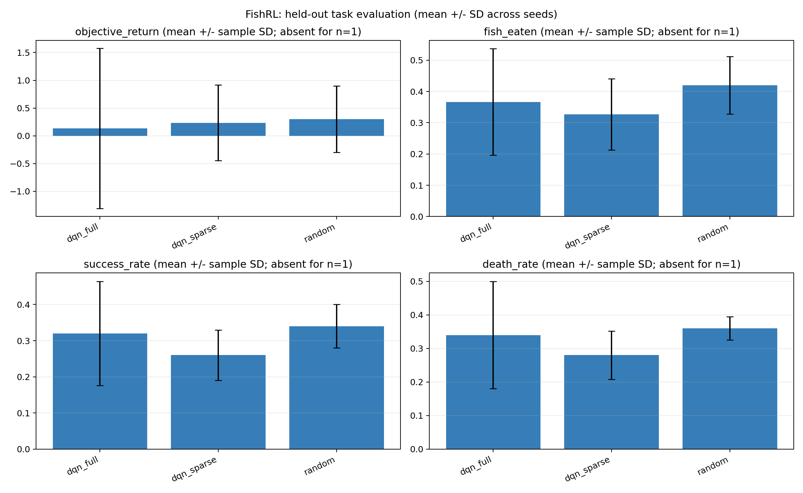
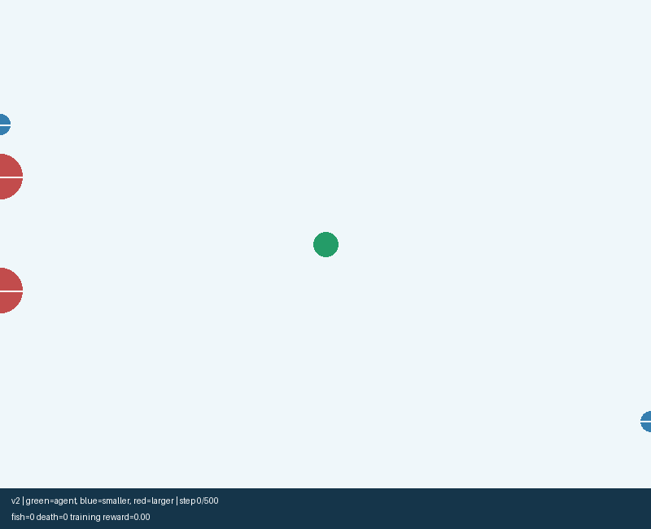

# FishRL Learning：奖励塑形真的让鱼吃得更多吗？

一个基于“大鱼吃小鱼”的强化学习学习项目：使用 Dueling 网络和 Double DQN 更新，
比较稀疏奖励、距离奖励塑形与随机策略。重点是**可核查的实验与失败分析**，不是新算法或论文复现。

**当前结论：在本次小预算实验中，两种 DQN 的平均吃鱼数均未超过随机策略。**
这不能证明 DQN 无效，也不能宣称奖励塑形带来稳定提升。

## 1. 问题与本次实验

原型曾直接比较不同奖励函数下的训练分数，但分数尺度不同，不能据此判断谁更会吃鱼。
本次把“学习用的奖励”和“统一的任务评估”分开，并增加无需训练的随机策略。

- 环境版本：finite-horizon-v2，每局死亡或500步时域结束；28维观测包含剩余时间和其他鱼的速度。
- 方法：随机动作、稀疏奖励 DQN、完整塑形奖励 DQN；两种 DQN 使用相同网络与探索配置。
- 预算：每种 DQN 各3个种子，每个种子15,000次环境交互；不是用不同长度的局数对齐。
- 评估：每个方法/种子50局，共450局。DQN 使用贪心策略，评估不更新网络和经验回放。
- 主要指标：每局吃鱼数；附带死亡率、吃到至少一条鱼的比例、统一任务分“5×吃鱼数−5×死亡次数”。
- 完整参数、种子规则与运行前确定的方案见 [实验协议](docs/PROTOCOL_V2.md)。

## 2. 真实结果（2026-08-31）

以下是先对每个种子的50局求均值，再对3个种子汇总的均值±样本标准差。
标准差不是置信区间；150局评估也不等于150次独立训练。

| 方法 | 吃鱼数/局 | 死亡率 | 统一任务分 |
|---|---:|---:|---:|
| Random | 0.420 ± 0.092 | 0.360 ± 0.035 | 0.300 ± 0.600 |
| DQN · sparse | 0.327 ± 0.114 | 0.280 ± 0.072 | 0.233 ± 0.681 |
| DQN · full | 0.367 ± 0.170 | 0.340 ± 0.160 | 0.133 ± 1.443 |



能看见的现象：full 比 sparse 的平均吃鱼数高一些，但波动也大，且没有超过随机基线。
sparse 的死亡率较低，未同时带来更高吃鱼数。不能只挑有利指标说方法更好。
原因尚未确定；[结果分析与后续检验](docs/EXPERIMENTS.md)区分了观察事实与待验证假设。

原始逐局记录、每次运行的完整配置、训练日志和汇总位于 [data/v2_small](data/v2_small)。
旧27维环境的18条 pilot 记录保留在 [data/pilot](data/pilot)，不与本次数据混用。

## 3. 安装、验证和重跑

以下命令在仓库根目录运行。建议独立 Python 环境；本机已测试 Python 3.13.9 CPU 环境，
具体版本见 [验证记录](docs/VALIDATION.md)，不承诺所有依赖组合均可运行。

```bash
python -m pip install -r requirements.txt
python -m pytest -q -p no:cacheprovider
```

先跑很短的流程测试（不足以训练出有效策略）：

```bash
python run_experiments.py --methods random,dqn_sparse,dqn_full --seeds 0 --steps 150 --eval-episodes 2 --max-steps 30 --warmup 64 --decay-steps 100 --output results_smoke
python analyze_results.py --input results_smoke/runs.csv --output results_smoke
```

重跑本次完整的小预算实验：

```bash
python run_experiments.py --methods random,dqn_sparse,dqn_full --seeds 0,1,2 --steps 15000 --eval-episodes 50 --max-steps 500 --warmup 500 --decay-steps 10000 --threads 1 --output results_v2 --verbose
python analyze_results.py --input results_v2/runs.csv --output results_v2
```

不训练也可从已归档数据重画结果：

```bash
python analyze_results.py --input data/v2_small/runs.csv --output results_archived
```

训练输出目录必须为空，避免覆盖数据。默认 CPU 单线程；固定种子不等于跨机器逐位一致。
检查点供推理，不包含优化器、回放和全部随机状态，不支持精确断点续训。

## 4. 固定种子的当前版本演示



录制对象在实验方案中事先固定为 full、训练种子0、第一局评估，不搜索“最好的一局”。
绿色为智能体、蓝色为小鱼、红色为大鱼。录像只解释行为，不代替上方450局统计。
[录像元数据](media/v2_demo.json)包含环境种子、结果和模型哈希。

```bash
python record_demo.py --run-dir data/v2_small/runs/dqn_full__seed=0 --output results_demo/replay.gif
```

仓库仅保留该当前版本的演示检查点；其他5个新检查点保留在本地，并记录哈希。
旧游戏及旧模型放在 [prototype](prototype)，其21维权重不能载入当前28维网络。
旧GIF不是当前实验结果，已从首页主展示移开。

## 5. 数学理解与项目边界

[数学学习草稿](docs/LEARNING_NOTES_DRAFT.md)按“定义—递推证明—算法—手算—反例”组织：
有限时域、Bellman递推、Double DQN目标、Dueling分解，以及奖励与任务指标的区别。
这是 AI 辅助编写、待学习者核对的草稿，不代表作者已独立推导或完全掌握。

本项目有状态转移与延迟回报，属于强化学习实践；它不是此前 UCB、EXP3、重尾老虎机实验的替代，
也不声称复现黄隆波老师的研究。

## 6. 来源与贡献

仓库由已有本地学习代码整理，使用了 AI 辅助编写、排查、实验执行及文档整理。
本次协议、实现修订、测试和结果汇总由 AI 助手协助完成；学习者的具体个人贡献仍需本人核对补充。
不声称全部独立实现，不把学习笔记包装成原创研究。

第三方代码/素材的来源与许可尚需本人核实，暂不添加未经确认的开源许可证。
当前保持私有；公开前请先完成 [来源与贡献核对](docs/PROVENANCE.md)。

```text
fishrl/                 当前28维环境与智能体
run_experiments.py      固定步数训练、随机基线、独立评估、逐局日志
analyze_results.py      跨种子汇总与图表
record_demo.py          固定评估局录像与来源元数据
tests/                  环境、终止语义、评估隔离和流程测试
data/v2_small/          本次可核查实验记录
data/pilot/             历史试运行记录（独立保留）
prototype/              原型与旧演示模型
docs/                   协议、结果分析、学习草稿、来源和验证
```
