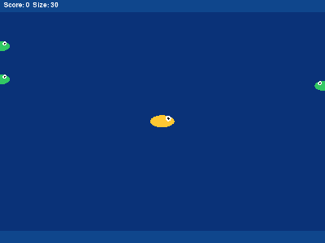

# FishRL Learning：大鱼吃小鱼强化学习实验

使用 Dueling / Double DQN 学习游戏决策，探索稀疏奖励、奖励塑形与探索策略的关系。
这是一个持续完善的**学习项目**，不是论文复现或已验证的算法改进。



上图为旧原型的历史演示，不代表改进版实验结果，也不用于判断算法优劣。

## 我想弄清的问题

1. 在相同任务下，增加过程奖励是否真的提高吃鱼能力？
2. 训练奖励变高，为什么可能不代表策略变好？
3. 在统一训练预算下，不同探索策略的表现有多大波动？

早期报告直接比较不同奖励函数下的训练总分，这种比较不足以支持策略优劣结论。
现在将训练奖励与统一评估指标分开，采用独立评估和多个随机种子，并保留失败结果。
目前只有小规模试运行数据，尚不能据此宣称某种方法更好。

## 安装与快速运行

建议 Python 3.10 或更新版本，使用独立虚拟环境。以下命令在仓库根目录运行：

```bash
python -m pip install -r requirements.txt
python -m pytest -q -p no:cacheprovider
python run_experiments.py --rewards sparse,full --explorations epsilon,dynamic_softmax --seeds 0 --episodes 3 --eval-episodes 2 --max-steps 50 --warmup 20 --device cpu --output results_smoke
python analyze_results.py --input results_smoke/runs.csv --output results_smoke
```

这条短命令只用于验证流程，不足以训练出有效策略。实验输出目录必须是新目录，避免覆盖旧结果。
CPU/GPU、依赖版本可能影响结果；固定种子不等于跨硬件逐位一致。

## 观看原版小游戏

```bash
python -m pip install -r prototype/requirements.txt
python prototype/play.py --model prototype/models/dueling_dqn_dense_best.pth --episodes 3
```

包含一个体积较小的旧模型用于展示。它来自原型实验，训练配置未完整留档，文件名中的 `best`
是历史命名，**不能证明它是最佳模型**。本仓库不将它用于改进版性能评估。
原型为21维观测，改进版为27维，权重不能互换。详情见 [原型说明](prototype/README.md)。

## 实验方法

- 观测：自身坐标与尺寸，以及最近六条鱼的相对位置、相对尺寸和有符号水平速度，共27维。
- 动作：上、下、左、右。
- 算法：Double DQN目标值；网络可选择普通结构或Dueling结构。
- 探索：epsilon-greedy、固定温度Boltzmann、退火温度Boltzmann。
- 奖励：稀疏、接近小鱼、增加危险惩罚、再增加顶墙惩罚。
- 统一评估：`5 × 吃鱼数 − 5 × 死亡次数`、吃鱼数、至少吃到一条鱼的比例、死亡率。
- 评估使用独立环境种子和贪心策略，不进入经验回放。

`dynamic_softmax`只是退火Boltzmann探索的代码名称，不是特定论文中Dynamic Boltzmann算子的复现。
不同奖励模式的 `training_return` 不可直接用于策略优劣比较。

## 已有数据与结果范围

[data/pilot](data/pilot) 保存原项目留下的18条试运行记录：
2种奖励 × 3种探索 × 3个种子；每次20局训练、10局评估、每局最多300步。
这是历史试运行，不是完整实验。CSV中的耗时来自当时的设备。

```bash
python analyze_results.py --input data/pilot/runs.csv --output results_pilot_summary
```

分析输出为跨种子均值与样本标准差；标准差不是置信区间。
仅一个种子时标准差记为缺失，不用零误导读者认为没有不确定性。
尚未运行的扩大实验方案见 [实验计划与局限](docs/EXPERIMENTS.md)。

## 目录

```text
fishrl/               改进版环境和智能体
run_experiments.py    训练与独立评估
analyze_results.py    汇总和绘图
tests/               环境、策略和训练流程测试
data/pilot/          历史试运行配置与原始汇总记录
prototype/           原版可视化小游戏和一个演示模型
media/               原版演示GIF
docs/                方法边界、来源说明与验证记录
```

## 来源与诚实说明

本仓库由已有本地学习项目整理而来，代码、文档和排查过程使用过AI辅助。
不将全部代码声称为本人独立实现，也不将学习笔记或实验方案声称为原创研究成果。
上传前的整理与测试不等于完成了多种子大规模验证。
第三方代码/素材的原始来源和许可尚需持续核实，暂不添加未经确认的开源许可证。
详见 [来源与版本说明](docs/PROVENANCE.md)。
